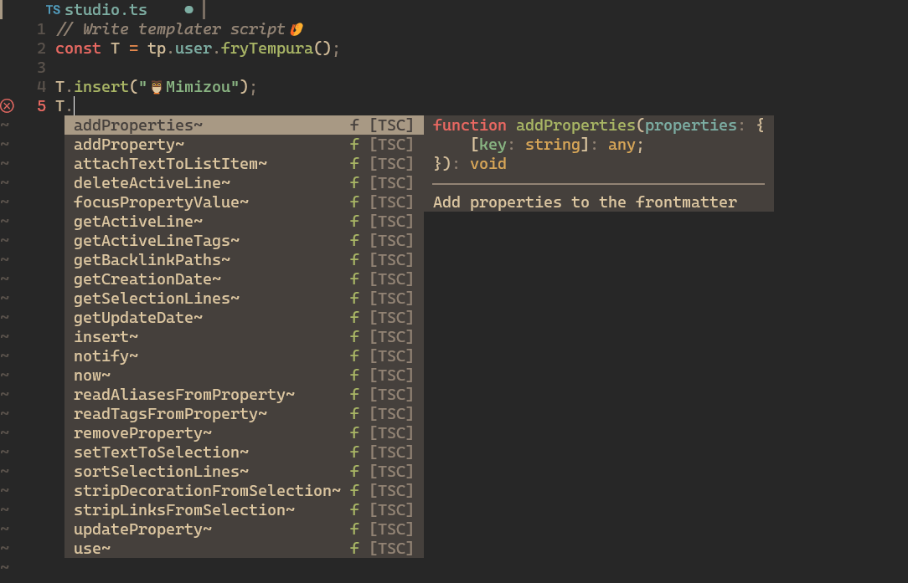

# Obsidian Tempura Studio

## Quickstart

```console
git clone https://github.com/tadashi-aikawa/obsidian-tempura-studio.git --depth 1
cd obsidian-tempura-studio
npm i
```

```console
vim config.json
```

```json
{
  "dist": "<Template folder location>"
}
```

```console
npm run build:watch
```

Then, we’ll be able to edit src/*.ts with static type checking and auto-completion! 🍤



If the file is changed, src/*.ts will be immediately transpiled, generating <dist>/*.md.
